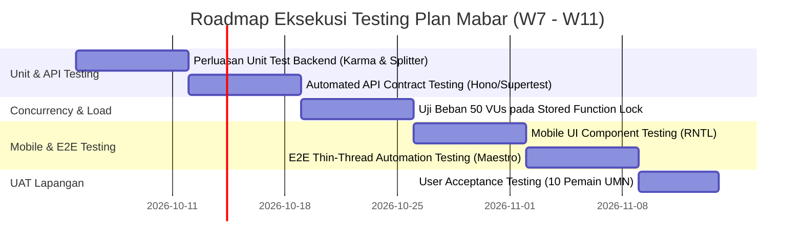

# Rencana Strategi Pengujian Perangkat Lunak (Master Testing Plan) — W7 s/d W11

**Deliverable ID:** E-74  
**Bagian Laporan:** Part B (B6.4 Testing Plan)  
**Periode Pelaksanaan:** Milestone 3 (Week 7 s/d Week 11)  
**Kepatuhan Standar:** Definition of Done (DoD 4 — Automated Testing & Continuous Verification)  
**Tanggal Pengesahan:** 27 September 2026

---

## 1. Tujuan & Filosofi Pengujian

Dokumen Master Testing Plan ini mendefinisikan strategi jaminan kualitas (*Quality Assurance*) untuk mengawal pengembangan platform Mabar dari fase *Prototype* (W6) menuju *Full Functional MVP* yang siap digunakan di lapangan pada Week 11. Pengujian menerapkan piramida pengujian terstruktur (*Testing Pyramid*) yang mengkombinasikan pengujian unit otomatis, pengujian integrasi kontrak API, pengujian beban konkruensi, dan evaluasi kegunaan manual.

---

## 2. Matriks Rencana Pengujian Multi-Level (W7–W11)

| Level / Jenis Pengujian | Tools & Framework | Lingkup Modul yang Dicakup (*Scope of Testing*) | Kriteria Lolos (*Pass Criteria*) | Target Eksekusi | Penanggung Jawab |
| :--- | :--- | :--- | :--- | :---: | :---: |
| **Unit Testing (Backend)** | **Jest v30** | Logika bisnis independen: validasi form sesi, kalkulasi split-bill, delta poin Karma, dan pembagian kubu Balanced Team Splitter. | Test Coverage $\ge 80\%$, $100\%$ assertions hijau di CI runner. | **W7 – W8** | Backend Engineer |
| **Integration API Testing** | **Hono Client / Supertest** | Kontrak HTTP endpoint: status code, otorisasi JWT bearer, penolakan payload cacat, isolasi RLS database Supabase. | Zero regression pada seluruh rute API `/api/*`. | **W8** | Backend Engineer |
| **Concurrency & Load Testing** | **k6 / Autocannon** | Pengujian beban konkruensi perebutan 1 slot terakhir pada stored procedure `join_session_atomic` (50 VUs). | Tidak ada overbooking (maksimal 1 sukses, 49 ditolak secara elegan); p95 latency $< 300\text{ ms}$. | **W8 – W9** | Lead Architect |
| **Mobile Component Testing** | **Jest & React Native Testing Library** | Komponen UI Langui Fusion: rendering Bento Grid, tema token warna, formatted time/currency input, proteksi form. | Snapshot lolos dan event handling tombol teruji tanpa throw error. | **W9** | Mobile Engineer |
| **End-to-End (E2E) Flow** | **Maestro / Detox** | Alur tipis lengkap pada emulator Android: Register $\rightarrow$ Explore $\rightarrow$ Create Session $\rightarrow$ Join Slot $\rightarrow$ Review. | Alur login hingga lobby selesai tanpa crash di Android 13+. | **W10** | Mobile & QA |
| **Manual User Acceptance (UAT)** | **Google Form & Checklist Skenario** | Simulasi mabar fisik: 10 pengguna mahasiswa UMN mencoba membuat sesi futsal dan membagi tim di lapangan asli. | SUS (System Usability Scale) $> 75$; zero blocking bugs. | **W11** | Product Owner & QA |

---

## 3. Jadwal & Milestone Pengujian Bertahap

---

## 4. Kebijakan Gatekeeping CI/CD (Definition of Done)

Sebelum kode di-merge ke branch `dev` atau `main`:
1. GitHub Actions runner (`.github/workflows/ci.yml`) wajib mengeksekusi suite Jest dan syntax linting.
2. Setiap Pull Request yang gagal pada tahap automated test akan secara otomatis diblokir dari proses merge (*CI Green Gate*).
3. Laporan cakupan test (*coverage report*) disimpan sebagai artefak CI yang dapat diaudit oleh tim dan dosen pembimbing.

Berkas rencana pengujian ini memenuhi deliverable **E-74**.
